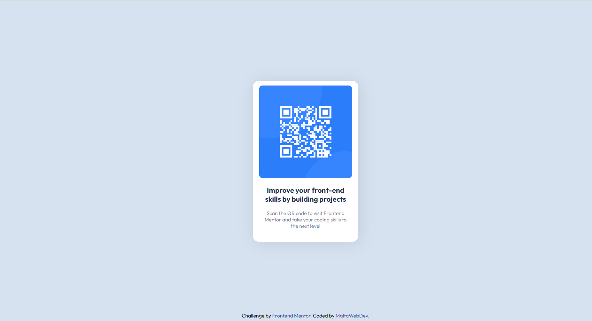

# Frontend Mentor - QR code component solution

This is my solution to the [QR code component challenge on Frontend Mentor](https://www.frontendmentor.io/challenges/qr-code-component-iux_sIO_H).

## Table of contents

- [Overview](#overview)
  - [Screenshot](#screenshot)
  - [Links](#links)
- [My process](#my-process)
  - [Built with](#built-with)
- [Author](#author)

## Overview

### Screenshot

### Links

- Solution URL: [Github](https://github.com/MaltaWebDev/QR-Component)
- Live Site URL: [Live site URL](https://maltawebdev.github.io/QR-Component/)

## My process

### Built with

- Semantic HTML5 markup
- CSS custom properties
- CSS variables
- Flexbox
- CSS Grid

## Author

- Website - [Malta Web Dev](https://github.com/MaltaWebDev/)
- Frontend Mentor - [@MaltaWebDev](https://www.frontendmentor.io/profile/MaltaWebDev)
